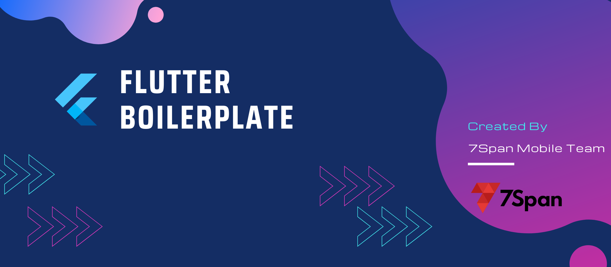

## Flutter Boilerplate



### ⚡ Jumpstart Development — Prebuilt structure for faster and customised launch.


# 📝 Features:

- Leverages melos for mono-repo structure. ⚙️
- BLoC architecture for scalable state management.🏗️
- Navigator 2.0 routing with auto_route for seamless navigation.🛣️
- Pre-configured environment handling with envied for secure variables.🔐
- Pre-set Firebase and flavor configuration for multi-environment support.🔥
- One-click setup with scripts to initialize the boilerplate in seconds. ⚡
- Well-structured documentation for easy onboarding.📖
- Pre-defined custom widgets to speed up UI development. 🧱
- **Atomic Design Pattern** for modular and maintainable UI.⚛️
- Enhanced features with built-in [app_notification](https://codelabs-preview.appspot.com/?file_id=1BDawGTK-riXb-PjwFCCqjwZ74yhdzFapw9kT2yJnp88#13), [authentication module](https://codelabs-preview.appspot.com/?file_id=1BDawGTK-riXb-PjwFCCqjwZ74yhdzFapw9kT2yJnp88#14) and [app_subscription](https://codelabs-preview.appspot.com/?file_id=1BDawGTK-riXb-PjwFCCqjwZ74yhdzFapw9kT2yJnp88#15) packages. 🚀

# 🗂️ Documentation

Built with ❤️ using Codelab for a seamless learning experience.
- Explore the step-by-step guide on [Codelab](https://codelabs-preview.appspot.com/?file_id=1BDawGTK-riXb-PjwFCCqjwZ74yhdzFapw9kT2yJnp88#0).

# 🏁 Getting Started

1. Clone the repository.
2. Run the set-up script in terminal.
 ```
 sh scripts/init.sh 
 ```

3. Launch application using below command or from IDE.
```
flutter run -t apps/app_core/lib/main_development.dart --flavor development
```

> ✅ **Note:** To know more about `project set-up scripts` see the [documentation](https://codelabs-preview.appspot.com/?file_id=1BDawGTK-riXb-PjwFCCqjwZ74yhdzFapw9kT2yJnp88#2).


# 🤝 Contribution

Contributions are welcome! If you have suggestions, improvements, or bug fixes, please open an issue
or submit a pull request.

1. Fork the repository.
2. Create a new branch (feature-branch)
3. Commit your changes.
4. Push to the branch and submit a pull request.

# 📬 Contact

For issues or suggestions, open an issue or reach out at dash@7span.com.
