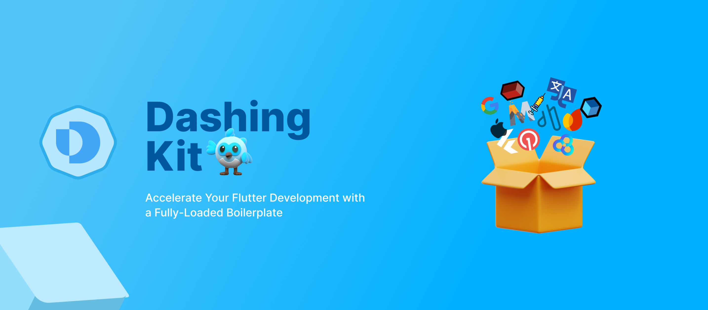

## Flutter Boilerplate



<a href="https://www.producthunt.com/products/dashingkit-a-flutter-boilerplate?embed=true&utm_source=badge-featured&utm_medium=badge&utm_source=badge-dashingkit&#0045;a&#0045;flutter&#0045;boilerplate" target="_blank"></a>

### ⚡ Jumpstart Development — Prebuilt structure for faster and customised launch.


# 📝 Features:

- Leverages melos for mono-repo structure. ⚙️
- BLoC architecture for scalable state management.🏗️
- Navigator 2.0 routing with auto_route for seamless navigation.🛣️
- Pre-configured environment handling with envied for secure variables.🔐
- Pre-set Firebase and flavor configuration for multi-environment support.🔥
- One-click setup with scripts to initialize the boilerplate in seconds. ⚡
- Well-structured documentation for easy onboarding.📖
- Pre-defined custom widgets to speed up UI development. 🧱
- **Atomic Design Pattern** for modular and maintainable UI.⚛️

# 🗂️ Documentation

- Explore the step-by-step guide on our [Documentation](https://7span.com/open-source/dashing-kit-docs/docs/intro).

# 🏁 Getting Started

1. Clone the repository.
```
git clone https://github.com/7span/dashing-kit.git
```

2. Run this script to ensure required project environment.
```
sh scripts/check_environment_configuration.sh
```

3. Run the set-up script in terminal.
 ```
 sh scripts/init.sh 
 ```

4. Launch application using below command or from IDE.
```
flutter run -t apps/app_core/lib/main_development.dart --flavor development
```

> ✅ **Note:** To know more about `project set-up scripts` see the [documentation](https://7span.com/open-source/dashing-kit-docs/docs/category/project-set-up).


# 🤝 Contribution

Contributions are welcome! If you have suggestions, improvements, or bug fixes, please open an issue
or submit a pull request.

1. Fork the repository.
2. Create a new branch (feature-branch)
3. Commit your changes.
4. Push to the branch and submit a pull request.

# 📬 Contact

For issues or suggestions, open an issue in this repository.
